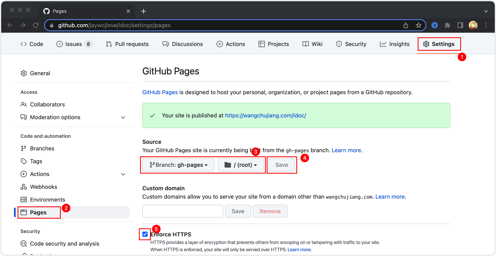

发布网站
===

文档网站搞好之后，可以发布到 `GitHub` 中，也可以部署到自己的服务器上面，`GitHub` 仓库提供一个 `gh-pages` 分支，用于静态资源托管，意味着你将静态页面生成 push 到这个分支直接可以预览。下面简单的介绍发布到 GitHub 中预览的步骤。

## 生成静态资源

通过命令运行生成静态资源，将根据 `idoc.yml` 生成到对于的目录中，默认生成到 `dist` 目录中，请阅读 [创建网站](site-creation.md) 教程

## 部署网站

我们拥有多种方法部署到 GitHub 免费的静态资源服务中。

### GitHub CI

通过在项目根目录创建 `.github/workflows/ci.yml` 监听 `master` 分支 `push` 自动将 `dist` 目录提交到 `gh-pages` 分支

```yml
name: CI
on:
  push:
    branches:
      - master

jobs:
  Build_Deploy:
    runs-on: ubuntu-18.04
    steps:
      - uses: actions/checkout@v2
      - uses: actions/setup-node@v2
        with:
          node-version: 14

      - run: npm install
      - run: npm run build

      - name: Deploy Website
        uses: peaceiris/actions-gh-pages@v3
        with:
          user_name: 'github-actions[bot]'
          user_email: 'github-actions[bot]@users.noreply.github.com'
          github_token: ${{ secrets.GITHUB_TOKEN }}
          publish_dir: ./dist
```

### 使用 gh-pages 工具

通过本地安装 `gh-pages`，您可以使用如下内容设置包脚本：

```bash
$ npm install gh-pages --save-dev
```

```js
"scripts": {
  "deploy": "gh-pages -d dist"
}
```

然后要将 `dist` 文件夹中的所有内容发布到 `gh-pages` 分支，您可以运行以下命令：

```bash
$ npm run deploy
```

## 在 GitHub 中配置

在配置中 `Setting` -> `pages` 设置

